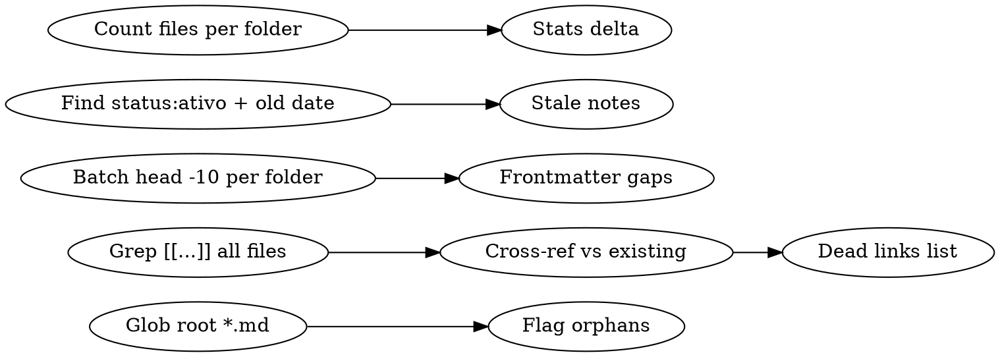

# Vault Daily Garden

Daily maintenance pipeline for the Cérebro Lyncis vault. Cleans up orphans, fixes frontmatter, processes the aprendizados inbox, updates synthesis notes, builds visual navigation (MOC, canvases, Bases), and updates the hot cache for Claude Code queries.

## Pre-Checks

Before starting, check idempotency:

```
VAULT = C:/Users/gabri/OneDrive/Desktop/Cérebro Obsidian/Cérebro Lyncis
TODAY = YYYY-MM-DD (current date)
GARDEN_LOG = Diario/YYYY/MM/YYYY-MM-DD-garden.md
```

1. Check if `GARDEN_LOG` exists via Glob
2. If exists AND has `## Phase 7` section → garden already ran today. Ask user: "Garden already ran today. Re-run specific phase or skip?"
3. If args contain `--phase <name>` → run only that phase
4. Prefer `obsidian-vault` MCP tools. If MCP fails on first call, fall back to Read/Glob/Grep for the rest of the run.

## Phase 1: AUDIT (read-only)

**Token budget: < 5K tokens of reads**

Collect problems into a structured list. Do NOT modify anything.



### 1a. Orphan Detection
- `Glob("*.md", path=VAULT)` at root level only (depth 1)
- Any .md at root = misplaced. Exclude `Painel Lyncis.md` and `_hot-cache.md` (garden artifacts)

### 1b. Dead Wikilinks
- Grep all `\[\[([^\]|#]+)` patterns → extract unique targets
- For each target, check if a matching .md exists (case-insensitive, any folder)
- Report: target → 0 matches = dead link

### 1c. Frontmatter Validation
Per tipo, validate required fields:

| tipo | Required | Should have |
|------|----------|-------------|
| recurso (sintese) | tipo, categoria, tags, cluster-id, membros | data-atualizacao |
| cliente | tipo, status, servico, valor-mensal, data-inicio | data-atualizacao |
| projeto-interno | tipo, status, tecnologias, data-criacao | data-atualizacao |
| diario | tipo, data, projetos-mencionados | — |

Use Bash: `head -10` in batch per folder, parse YAML frontmatter fields.

### 1d. Stale Content
- Notes with `status: ativo` AND `data-atualizacao` older than 60 days from today
- Daily note stubs: files in Diario/ smaller than 200 bytes (template-only)

### 1e. Stats
- Count files per top-level folder
- Compare to last garden log's stats (if exists)

### 1f. Stale Claims (absorvido de wiki-lint)
- Notas com `confianca: confirmado` E `data-atualizacao` mais antiga que 90 dias → marcar para revisão manual
- Reportar: lista de notas com claims potencialmente desatualizados

### 1g. Missing Cross-References (absorvido de wiki-lint)
- Sínteses que mencionam `[[ferramenta-X]]` no corpo mas a nota `ferramenta-X.md` não tem backlink de volta para a síntese
- Reportar: lista de pares (síntese → ferramenta sem backlink)
- Estes serão corrigidos na Phase 4b (Inject Backlinks)

### 1h. Empty Sections (absorvido de wiki-lint)
- Notas com `## Título` seguido diretamente de outro `## Título` sem conteúdo intermediário
- Pattern: `^## .+\n^## ` (regex multiline)
- Reportar: lista de notas com seções vazias para review manual

### 1i. Stale Index Entries (absorvido de wiki-lint)
- `_context.md` files mencionando arquivos que não existem mais no vault
- Para cada `_context.md`: extrair filenames referenciados → verificar existência → identificar entradas mortas
- Estas serão auto-corrigidas na Phase 3 (removidas das entradas do _context.md)

**Output:** Store audit results as internal variables for Phase 2. Print summary: `Audit: X orphans, Y dead links, Z frontmatter gaps, W stale notes, V stale claims, U missing xrefs, T empty sections, S stale index entries`

## Phase 2: TRIAGE

Classify each problem from Phase 1:

| Problem | Classification |
|---------|---------------|
| Empty root orphan that duplicates a note in Projetos/ | `auto-fix: delete` |
| Empty root orphan that is a concept (e.g., "Claude API.md") | `auto-fix: move + stub` |
| Missing `data-atualizacao` in synthesis notes | `auto-fix: set to today` |
| Stale active notes (60+ days) | `suggest: add warning callout` |
| Dead wikilinks to nonexistent notes | `suggest: create stub or fix link` |
| Merge candidates (near-duplicate filenames) | `suggest: manual review` |
| Template-only Diario stubs | `skip` |
| _context.md files lacking tipo | `skip: by design` |
| Stale claims (1f) | `suggest: manual review` |
| Missing cross-references (1g) | `auto-fix: inject backlinks in Phase 4b` |
| Empty sections (1h) | `suggest: manual review` |
| Stale index entries (1i) | `auto-fix: remove from _context.md in Phase 3` |

Print triage summary: `Triage: X auto-fix, Y suggestions, Z skipped`

## Phase 3: CLEANUP

Execute `auto-fix` items from Phase 2. For each action, log what was done.

### 3a. Delete Orphan Duplicates
- If orphan at root has a corresponding note in the correct folder → delete the root file
- Example: `cliente-aly-advocacia.md` (root, empty) → `Projetos/clientes/cliente-aly-adv.md` (real) → delete root

### 3b. Move Concept Stubs
- If orphan represents a concept → move to `Base de Conhecimento/ferramentas/` or appropriate subfolder
- Populate with minimal frontmatter from template-recurso pattern:
```yaml
---
titulo: [derived from filename]
tipo: recurso
categoria: ferramenta
tags: [recurso]
data-criacao: TODAY
data-atualizacao: TODAY
---
# [Title]
> [!todo] Stub — needs content
```

### 3c. Batch Frontmatter Fix
For synthesis notes missing `data-atualizacao`:
- Set `data-atualizacao` to today's date
- Use string replacement (NOT ET/YAML parser) to insert the field

### 3d. Stale Warning Injection
For notes with `status: ativo` and stale `data-atualizacao`:
- Prepend (after frontmatter) a callout:
```markdown
> [!warning] Desatualizado desde YYYY-MM-DD
> Esta nota está marcada como ativa mas não foi atualizada há N dias. Revise o status.
```
- Do NOT change the `status` field — only the user should do that

### 3e. Stale Index Entry Removal (absorvido de wiki-lint — 1i)
For each `_context.md` with stale entries:
- Remove or comment-out lines referencing files that no longer exist
- Log each removal: `Removed stale ref to [filename] from [_context.md path]`

## Phase 4: INTEGRATE

### 4a. Process Inbox

**Path:** `Base de Conhecimento/_inbox-aprendizados.md`

The inbox is populated by `/cerebro-lyncis:distill`. Each entry is a `### [Title] ^[slug]` block with metadata in an HTML comment.

1. Read the inbox file. If empty or missing → skip to 4b.
2. For each entry (parse by `### ` headings):
   - Extract `tags` and `slug` from `<!-- meta: ... -->` comment
   - Match to an existing synthesis note via: (a) tag overlap with synthesis frontmatter tags, (b) slug prefix matching existing `cluster-id`, (c) shared `[[ferramenta-*]]` wikilinks
   - If match found → append entry to that synthesis note's `## Entradas` section (before `## Conexões`)
   - If no match and 3+ unmatched entries share a theme → create new synthesis note with `## Entradas`
   - If no match and isolated → append to `sintese-geral.md` (catch-all)
3. After all entries processed, clear the inbox (replace with just the header)
4. Update `membros` count in frontmatter of each synthesis that received new entries
5. Update `data-atualizacao` to today on each touched synthesis

### 4b. Inject Backlinks

For each ferramenta/project note, check if it has `## Sínteses Relacionadas`. If not, create the section. Link to synthesis notes that reference this tool/project (deduplicated). This also resolves the missing cross-references identified in Phase 1g.

```markdown
## Sínteses Relacionadas
<!-- gerado por vault-daily-garden — não editar manualmente -->
- [[sintese-n8n-general]] — n8n Geral (53 entradas)
- [[sintese-n8n-definebelow]] — defineBelow Pattern (25 entradas)
```

For project notes, maintain `## Histórico de Sessões`:
```markdown
## Histórico de Sessões
<!-- gerado por vault-daily-garden -->
- [[2026-04-11]] — WF-EVAL Runner debugging
- [[2026-04-10]] — Eval framework setup
```

### 4c. Update _context.md Files

Enrich each `_context.md` with current stats. Add/update these sections:

```markdown
## Stats (atualizado YYYY-MM-DD)
- Total de notas: N
- Última modificação: YYYY-MM-DD (filename.md)

## Para Claude Code
- Cache rápido: [[_hot-cache]]
- Busca por frontmatter: `obsidian_complex_search` com `tipo: X AND status: Y`
```

For `Base de Conhecimento/_context.md`, also add synthesis summary table:
```markdown
## Sínteses (top 10 por entradas)
| Síntese | Entradas |
|---------|----------|
| [[sintese-n8n-general]] | 53 |
| [[sintese-claude-code-hooks]] | 63 |
```

## Phase 5: UPDATE SYNTHESES

For each synthesis note that received new entries in Phase 4a:

1. Read the full synthesis note
2. Check if `## Padrão Principal` and `## Regras de Ouro` still reflect the content including new entries
3. If new entries introduce a genuinely new pattern or contradict existing rules → regenerate pattern sections
4. If new entries are consistent → only update `membros` count in frontmatter
5. If no new inbox entries were processed → skip Phase 5 entirely

### Synthesis note template (for new syntheses created in Phase 4a)
```markdown
---
titulo: "Síntese — [Label]"
tipo: recurso
categoria: sintese
tags: [sintese, TAGS...]
data-criacao: YYYY-MM-DD
data-atualizacao: YYYY-MM-DD
gerado-por: vault-daily-garden
cluster-id: CLUSTER_ID
membros: N
---

# [Label]

> [!summary] N aprendizados destilados em padrões acionáveis

## Padrão Principal
[2-3 sentences: the core insight]

## Regras de Ouro
1. **[Rule]** — [one-line explanation]

## Anti-Padrões
- [What NOT to do] — [consequence]

## Entradas
<!-- Newest first. Cada entrada é uma unidade atômica de conhecimento. -->

### [Título] ^[slug]
> [!info]- Meta
> Data: YYYY-MM-DD | Origem: [[YYYY-MM-DD]] | Confiança: X | Versão: Y

[Conteúdo]

**Quando usar:** [contexto]
**Conexões:** [[...]]

---

## Conexões
- Ferramentas: [[ferramenta-...]]
- Projetos: [[proj-...]]
```

### Pattern Registry

Maintain `Base de Conhecimento/sinteses/_registro-padroes.md`. Populate from the `## Regras de Ouro` and `## Anti-Padrões` sections of each synthesis note.

## Phase 6: VISUALIZE

### 6a. Root MOC — `Painel Lyncis.md`

```markdown
---
titulo: Painel Lyncis
tipo: moc
data-atualizacao: YYYY-MM-DD
gerado-por: vault-daily-garden
---

# Painel Lyncis

> [!tip] Última atualização do jardim: YYYY-MM-DD

## Projetos Ativos

> [!example]+ Clientes
> | Cliente | Serviço | Status | Atualizado |
> |---------|---------|--------|------------|
> [rows from Projetos/clientes/ frontmatter]

> [!example]+ Projetos Internos
> | Projeto | Status | Atualizado |
> |---------|--------|------------|
> [rows from Projetos/internos/ frontmatter]

## Conhecimento Destilado

> [!abstract]+ Sínteses (padrões de N aprendizados)
> [wikilinks to top 10 synthesis notes by cluster size]
>
> [[_registro-padroes|Registro completo de padrões e anti-padrões]]

> [!abstract]+ Ferramentas
> [inline wikilinks to all ferramenta- notes]

> [!abstract]+ Frameworks
> [inline wikilinks to all framework- notes]

## Atividade Recente

> [!note]+ Últimos 7 dias
> [list of recent daily notes with one-line summaries from ## Foco do Dia]

## Saúde do Vault

> [!warning]- Itens que precisam de atenção
> [problems from Phase 2 classified as "suggest"]
```

### 6b. Ecosystem Canvas — `Canvas — Ecossistema Lyncis.canvas`

JSON Canvas with:
- **Groups:** "Tráfego Pago" (color 2/orange), "Assistentes IA" (color 5/cyan)
- **File nodes:** Each client note, project note, ferramenta note
- **Edges:** client → tools used, project → tools used
- Position: clients on left (x:0-400), tools on right (x:600-1000), projects center (x:200-600, y:400+)
- Generate unique 16-char hex IDs for all nodes/edges

### 6c. Knowledge Canvas — `Base de Conhecimento/Canvas — Mapa de Conhecimento.canvas`

JSON Canvas with:
- **Groups:** One per synthesis cluster (labeled with cluster name)
- **File nodes:** Each synthesis note + each ferramenta
- **Edges:** synthesis → ferramenta (if cluster references the tool)
- Arrange groups in a grid layout, 500px apart

### 6d. Bases Views

**Project Tracker** — `Projetos/Projetos Tracker.base`:
```yaml
filters:
  or:
    - file.hasTag("cliente")
    - file.hasTag("projeto-interno")

formulas:
  dias_sem_atualizar: 'if(data-atualizacao, (today() - date(data-atualizacao)).days, "")'

properties:
  formula.dias_sem_atualizar:
    displayName: "Dias s/ atualizar"

views:
  - type: table
    name: "Todos os Projetos"
    order:
      - file.name
      - tipo
      - status
      - data-atualizacao
      - formula.dias_sem_atualizar
    groupBy:
      property: status
      direction: ASC
```

**Sínteses Explorer** — `Base de Conhecimento/sinteses/Sinteses Explorer.base`:
```yaml
filters:
  and:
    - file.inFolder("Base de Conhecimento/sinteses")
    - 'file.ext == "md"'

formulas:
  entradas: 'membros'

properties:
  formula.entradas:
    displayName: "Entradas"

views:
  - type: table
    name: "Sínteses"
    limit: 50
    order:
      - file.name
      - cluster-id
      - membros
      - data-atualizacao
    groupBy:
      property: cluster-id
      direction: ASC
```

## Phase 7: REPORT

### 7a. Garden Log

Write to `Diario/YYYY/MM/YYYY-MM-DD-garden.md`:

```markdown
---
tipo: garden-log
data: YYYY-MM-DD
gerado-por: vault-daily-garden
---

# Garden Log — YYYY-MM-DD

## Resumo
- Auditadas: N notas
- Problemas encontrados: X
- Corrigidos automaticamente: Y
- Sugestões para revisão manual: Z

## Ações Realizadas
### Cleanup
- [x] [action descriptions]

### Integração
- [x] Detectados N clusters de aprendizados
- [x] Geradas/atualizadas N sínteses
- [x] Adicionados N backlinks
- [x] Atualizados N _context.md

### Visualização
- [x] Painel Lyncis.md atualizado
- [x] Canvas Ecossistema atualizado
- [x] Hot cache regenerado

## Sugestões para Revisão Manual
> [!todo] [suggestions from Phase 2]
```

### 7b. Hot Cache

Write/update `_hot-cache.md` at vault root:

```markdown
---
tipo: cache
data-atualizacao: YYYY-MM-DD
gerado-por: vault-daily-garden
---

# Hot Cache — Cérebro Lyncis

## Vault Stats
- N notas | N aprendizados | N clusters | N clientes ativos | N projetos internos
- Último garden: YYYY-MM-DD

## Projetos Quentes (tocados nos últimos 7 dias)
[from recent daily notes' projetos-mencionados]

## Pendências Ativas
[from most recent daily note's unchecked tasks]

## Warnings Top-5
[from warnings.json if it exists in project memory]

## Navegação Rápida
| Preciso de... | Ler... |
|---------------|--------|
| Estado de um cliente | `Projetos/_context.md` → `clientes/cliente-xxx.md` |
| Padrão n8n | `Base de Conhecimento/sinteses/sintese-n8n-xxx.md` |
| Decisão recente | `Diario/YYYY/MM/` → nota mais recente |
| Ferramenta | `Base de Conhecimento/ferramentas/ferramenta-xxx.md` |
| Todos os padrões | `Base de Conhecimento/sinteses/_registro-padroes.md` |
| Painel completo | `Painel Lyncis.md` |
```

### 7c. Daily Note Annotation

Append to today's daily note (create if doesn't exist):
```markdown
- Garden: X fixes, Y insights, Z suggestions — [[YYYY-MM-DD-garden|ver log]]
```

## Common Mistakes

| Mistake | Fix |
|---------|-----|
| Running Phase 5 without Phase 4 | Synthesis updates need inbox processing first. Always run in order or use `--phase` for individual re-runs. |
| Creating individual aprendizado files | Aprendizados go to the inbox buffer, not individual files. /cerebro-lyncis:distill appends to `_inbox-aprendizados.md`. |
| Using ET/YAML parser for frontmatter edits | String replacement only — parsers can break formatting. |
| Auto-changing `status` on stale notes | Only add warning callout. Status changes are user decisions. |
| Regenerating synthesis when no new entries | Only regenerate pattern sections if new inbox entries were added. |
| Writing canvas with literal `\\n` | Use `\n` for JSON newlines in text nodes. |

## When NOT to Use

- For one-off vault queries → use `/cerebro-lyncis:query` instead
- For ingesting new sources → use `/cerebro-lyncis:ingest`
- For writing new notes or bases ad-hoc → use `/cerebro-lyncis:canvas` or `/cerebro-lyncis:bases`
- This skill is for **daily maintenance**, not ad-hoc exploration
